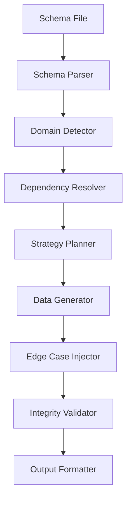

# 🇻🇳 vibe-mock-data-generator-agent

> Generate realistic, referentially-valid mock data from database schemas — with first-class Vietnamese market support.

<p align="center">


</p>

<p align="center">
  <strong>📦 Schema-Driven</strong> •
  <strong>🔗 FK-Safe</strong> •
  <strong>🇻🇳 Vietnamese-Native</strong> •
  <strong>🎯 Deterministic</strong> •
  <strong>📁 6 Output Formats</strong> •
  <strong>🍃 MongoDB Ready</strong>
</p>

---

## ✨ Why This Exists

Most mock-data generators create records like:

```json
{
  "name": "User1",
  "email": "user1@test.com",
  "phone": "1234567890"
}
```

Real production systems look more like:

```json
{
  "name": "Nguyễn Thị Bích Phương",
  "email": "nguyen.thi.bich.phuong@example.com",
  "phone": "0912345678",
  "role": "CUSTOMER"
}
```

Production bugs often hide in:

* Vietnamese names with diacritics
* Unicode edge cases
* Long addresses
* Foreign-key relationships
* Business workflow constraints
* Boundary values
* Null handling

This project generates **production-like data**, not demo data.

---

## 🚀 Features

| Feature                  | Description                                                       |
| ------------------------ | ----------------------------------------------------------------- |
| 📦 Schema-Driven         | Parse Prisma, SQL DDL, TypeORM, JSON Schema, MongoDB              |
| 🔗 Referential Integrity | Guaranteed FK-safe datasets with zero FK violations               |
| 🇻🇳 Vietnamese-Native   | Names, phones, addresses, CCCD IDs, VND prices                    |
| 📊 Statistical Modeling  | Pareto distributions, weighted enums, realistic business patterns |
| 🧪 Edge Cases            | Unicode, NULLs, max-length strings, boundary values               |
| 📁 Multi-Format Export   | Prisma, SQL, JSON, CSV, Factories, MongoDB                        |
| 🎯 Deterministic Mode    | Reproducible output using random seeds                            |
| 🤖 Ollama Integration    | AI-generated Vietnamese text with Faker fallback                  |
| 🍃 MongoDB Support       | Generate MongoDB seed scripts or seed directly                    |

---

## 📚 Table of Contents

* [Quick Start](#-quick-start)
* [CLI Reference](#-cli-reference)
* [Architecture](#-architecture)
* [Output Formats](#-output-formats)
* [MongoDB Support](#-mongodb-support)
* [Vietnamese Data](#-vietnamese-data)
* [Statistical Modeling](#-statistical-modeling)
* [Edge Cases](#-edge-cases)
* [Configuration](#-configuration)
* [Project Structure](#-project-structure)
* [Tech Stack](#-tech-stack)
* [Roadmap](#-roadmap)
* [License](#-license)

---

# ⚡ Quick Start

### Install

```bash
npm install
```

### Build

```bash
npm run build
```

### Generate JSON Fixtures

```bash
node dist/index.js \
  --schema ./schema.sql \
  --type ddl \
  --format json
```

### Generate All Formats

```bash
node dist/index.js \
  --schema ./schema.sql \
  --type ddl \
  --format prisma-seed,sql,json,csv,factory,mongodb
```

### Generate MongoDB Seed Script

```bash
node dist/index.js \
  --schema ./schema.json \
  --type mongodb \
  --format mongodb
```

### Deterministic CI/CD Mode

```bash
node dist/index.js \
  --schema ./schema.sql \
  --seed 42
```

---

# 📋 CLI Reference

| Flag       | Description                               | Default            |
| ---------- | ----------------------------------------- | ------------------ |
| `--schema` | Schema file path                          | Required           |
| `--type`   | prisma, ddl, typeorm, jsonschema, mongodb | Auto-detected      |
| `--config` | Config file path                          | —                  |
| `--output` | Output directory                          | `./generated`      |
| `--format` | Output formats                            | `prisma-seed,json` |
| `--seed`   | Deterministic seed                        | —                  |
| `--market` | vietnam, global, us, eu                   | `vietnam`          |
| `--quick`  | Generate 100 records only                 | false              |
| `--help`   | Show help                                 | —                  |

---

## Schema Auto Detection

| Extension    | Type                  |
| ------------ | --------------------- |
| `.prisma`    | Prisma                |
| `.sql`       | SQL DDL               |
| `.ts`, `.js` | TypeORM               |
| `.json`      | JSON Schema / MongoDB |

---

# 🏗 Architecture



---

# 📁 Output Formats

| Format            | Output            |
| ----------------- | ----------------- |
| Prisma Seed       | `seed.ts`         |
| SQL               | `seed.sql`        |
| JSON              | `fixtures.json`   |
| CSV               | `<entity>.csv`    |
| Factory Functions | `factories.ts`    |
| MongoDB Seed      | `seed-mongodb.ts` |

---

# 🍃 MongoDB Support

MongoDB is supported as both:

### Output Mode

Generate a standalone MongoDB seed script.

```bash
node dist/index.js \
  --type mongodb \
  --format mongodb
```

### Direct Seed Mode

```typescript
const connector = new DBConnector({
  type: "mongodb",
  host: "localhost",
  port: 27017,
  database: "myapp_test"
});

await connector.connect();
await connector.seed(data, seedOrder);
await connector.disconnect();
```

### MongoDB Features

* Collection dependency ordering
* UUID → `_id` conversion
* Bulk inserts
* Duplicate handling
* Ordered / unordered writes
* Relationship preservation

---

# 🇻🇳 Vietnamese Data

Built-in Vietnamese datasets provide realistic local data generation.

## Names

Coverage:

* 25 weighted surnames
* 20 middle names
* 80 given names

Examples:

```text
Nguyễn Thị Bích Phương
Trần Minh Quân
Lê Hoàng Anh Thư
```

---

## Phone Numbers

Weighted by carrier market share.

| Carrier   | Weight |
| --------- | ------ |
| Viettel   | 50%    |
| Mobifone  | 20%    |
| Vinaphone | 20%    |
| Others    | 10%    |

Examples:

```text
0912345678
0987654321
```

---

## Addresses

Structure:

```text
Province
 └─ District
     └─ Ward
         └─ Street
```

Example:

```text
826 Võ Văn Tần
Ward 5
District 3
Ho Chi Minh City
```

---

## CCCD Generator

Example:

```text
996195775132
998448556713
```

Reserved fake prefixes:

```text
900-999
```

---

# 📊 Statistical Modeling

## Pareto Distribution (80/20)

| Tier        | Users | Orders |
| ----------- | ----- | ------ |
| 🐋 Whale    | 2%    | 50-200 |
| 🔥 Heavy    | 18%   | 10-50  |
| 📈 Moderate | 30%   | 3-9    |
| 👣 Light    | 30%   | 1-2    |
| 😴 Dormant  | 20%   | 0      |

---

## Weighted Enum Defaults

```yaml
role:
  CUSTOMER: 85%
  ADMIN: 10%
  MODERATOR: 5%

status:
  ACTIVE: 65%
  INACTIVE: 15%
  PENDING: 10%
  ARCHIVED: 10%
```

---

# 🧪 Edge Cases

5% of generated records intentionally contain difficult test cases.

| Scenario              | Purpose            |
| --------------------- | ------------------ |
| NULL Values           | Validation         |
| Unicode Characters    | Encoding           |
| Max Length Strings    | Overflow           |
| Boundary Dates        | Date Handling      |
| Empty Strings         | Validation         |
| Negative Values       | Refund Logic       |
| SQL Injection Strings | Security Testing   |
| Duplicate Values      | UNIQUE Constraints |
| Soft Delete Conflicts | Business Rules     |

---

# ⚙️ Configuration

```yaml
version: "1.0"

generation:
  seed: 42
  market: vietnam

output:
  formats:
    - json
    - prisma-seed
    - mongodb

edgeCases:
  enabled: true
  percentage: 5

ollama:
  host: http://localhost:11434
  model: llama3.1:8b
  fallback: faker
```

Run:

```bash
node dist/index.js --config mock-data.config.yaml
```

---

# 📂 Project Structure

```text
src/

├── agents/
│   ├── orchestrator/
│   ├── schema-parser/
│   ├── dependency-resolver/
│   ├── strategy-planner/
│   ├── data-generator/
│   └── output-formatter/

├── ml/
│   ├── ollama-client.ts
│   ├── text-generator.ts
│   └── vietnamese-generator.ts

├── tools/
├── data/
├── prompts/
├── types/
└── index.ts
```

---

# 🛠 Tech Stack

| Layer            | Technology              |
| ---------------- | ----------------------- |
| Language         | TypeScript              |
| Runtime          | Node.js                 |
| Data Generation  | Faker.js                |
| AI Text          | Ollama                  |
| Validation       | Zod                     |
| Config           | YAML + JSON             |
| Schema Parsing   | Prisma DMMF, SQL Parser |
| Graph Algorithms | Kahn Topological Sort   |

---

# 📄 License

MIT

---

<p align="center">

Built with ❤️ for Vietnamese Developers

<br><br>

Production-like Mock Data • Schema-Driven • MongoDB Ready

</p>
